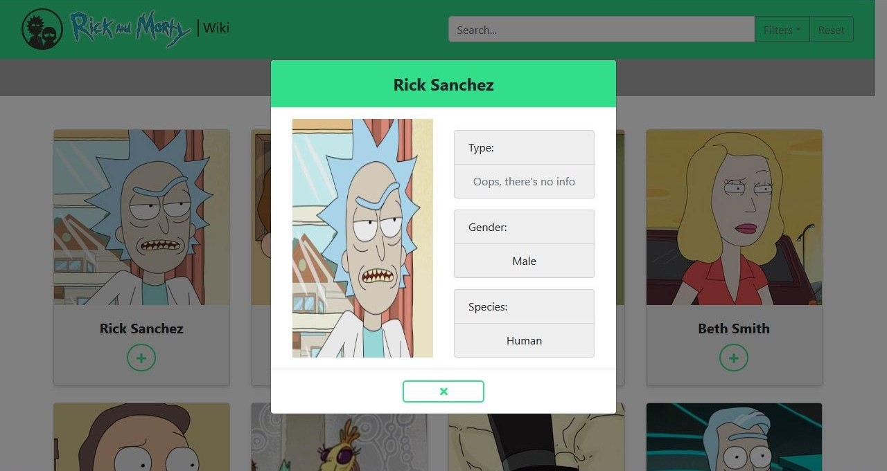
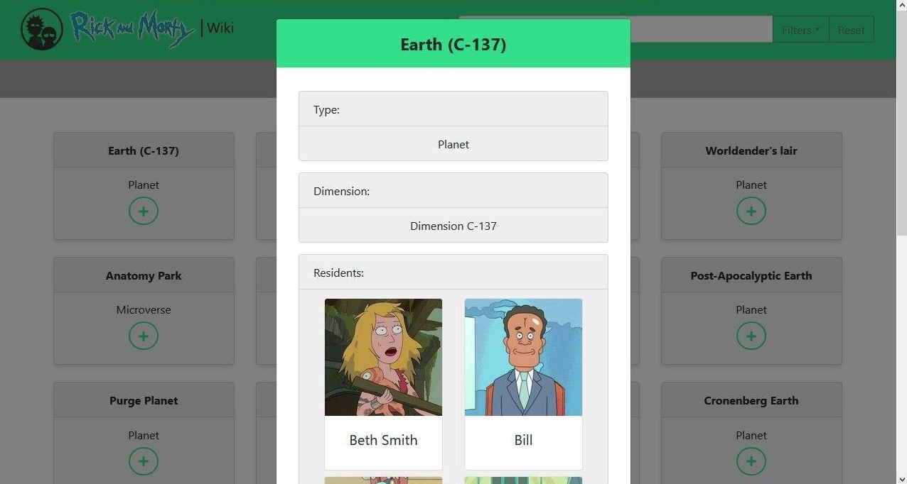

# 
 Rick & Morty Wiki 

## 
 React - Redux - TypeScript - Apollo - GraphQL - Bootstrap 

A very easy to use wiki where you will find information about Rick & Morty's characters, locations and episodes.

### Data shown in General views:
| Characters | Locations | Episodes |
|------------|-----------|----------|
|   Image    |   Name    |   Name   |
|   Name     | Dimension | Air date |

### Data shown in Detailed views:
| Characters | Locations | Episodes |
|------------|-----------|----------|
|   Image    |   Name    |   Name   |
|   Type     |   Type    | Air date |
|   Gender   | Dimension | Episode  |
|   Species  | Residents |Characters|

### Characters' views:

#### General:

#### Detailed:

### Locations' views:

#### General:

#### Deatailed:

### Episodes' views:

#### General

#### Detailed

## 
 Want to try it out? 

#### 1 - Clone this repo.
#### 2 - Open the terminal.
#### 3 - Run `yarn install` command.
#### 4 - Run `yarn start` command.
#### 5 - Let's enjoy!